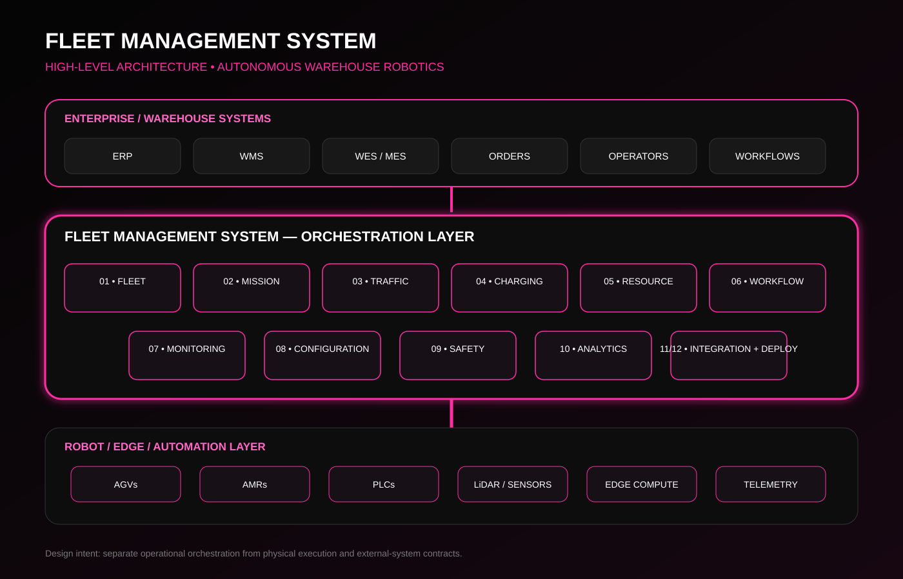
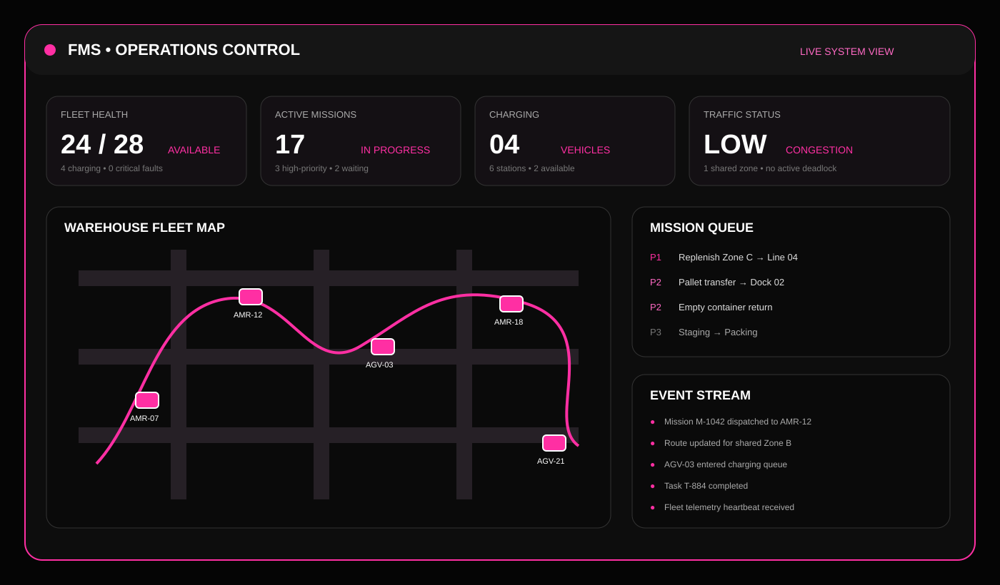
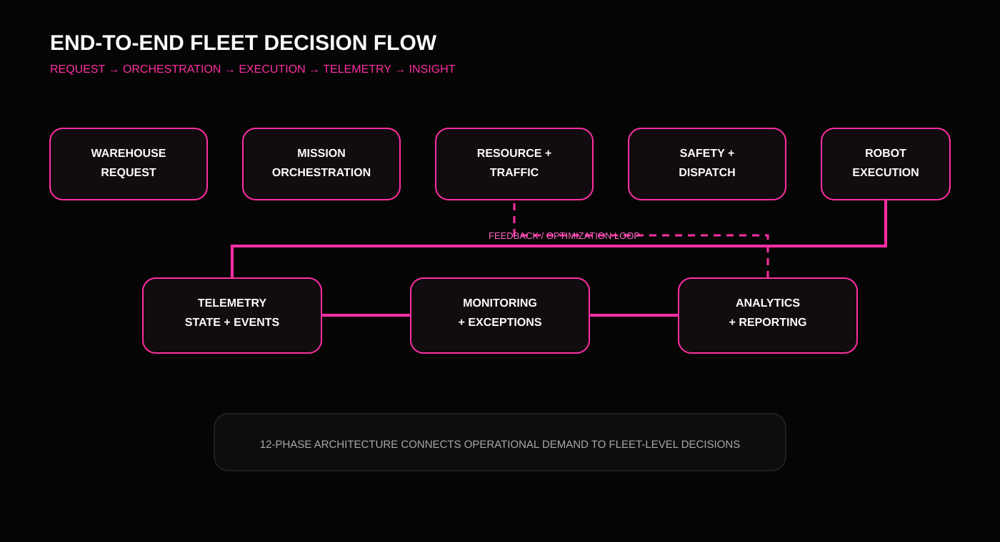

<div align="center">

# 🖤 FLEET MANAGEMENT SYSTEM
### High-Level Architecture for Autonomous Warehouse Robotics


[](#-architecture-at-a-glance)
[](#-system-context)
[](#-12-phase-architecture)
[](#-scope)

**A product-oriented, high-level system architecture for coordinating autonomous warehouse fleets, transport missions, traffic, charging, safety, monitoring, analytics, integrations, and deployment.**

</div>

---

## 🎯 What This Repository Demonstrates

This repository documents the **system-level thinking behind a Fleet Management System (FMS)** for autonomous warehouse robotics. The focus is not on a toy robot controller or a single navigation algorithm; it is on how the major operational capabilities fit together as one coherent product.

The architecture is organized into **12 functional phases**, progressing from fleet and mission control through traffic, charging, resources, workflows, monitoring, configuration, safety, analytics, integration, and deployment.

> **Scope:** High-level architecture and product/requirements case study. This repository does **not** claim to contain a production FMS implementation or a working warehouse simulation.

---

## 🧠 Architecture at a Glance

<p align="center">
  
</p>

### Design principle

**Business / Warehouse Demand → Mission Orchestration → Fleet Decisions → Traffic & Resource Coordination → Robot Execution → Telemetry → Monitoring & Analytics → Continuous Operational Feedback**

The architecture separates **decision-making**, **robot-facing execution**, **operational visibility**, and **external-system integration** so that the FMS can evolve without coupling every subsystem to every robot.

---

## 🏭 System Context

The FMS is positioned as the coordination layer between warehouse/enterprise systems and the physical robot fleet.

```text
                    ┌───────────────────────────────────────┐
                    │        ENTERPRISE / WAREHOUSE          │
                    │   ERP • WMS • WES • MES • Operators    │
                    └──────────────────┬────────────────────┘
                                       │ Orders / Requests
                                       ▼
                    ┌───────────────────────────────────────┐
                    │       FLEET MANAGEMENT SYSTEM          │
                    │  Mission • Traffic • Resources        │
                    │  Charging • Safety • Monitoring        │
                    │  Analytics • Integration • Config      │
                    └──────────────────┬────────────────────┘
                                       │ Commands / Policies
                                       ▼
             ┌────────────────────────────────────────────────────┐
             │                 ROBOT / EDGE LAYER                 │
             │     AGVs • AMRs • PLC Interfaces • Sensors         │
             │       LiDAR • Localization • Vehicle State         │
             └────────────────────────┬───────────────────────────┘
                                      │
                                      ▼
                         PHYSICAL WAREHOUSE FLOOR
```

---

# 🧩 12-Phase Architecture

## 01 — Fleet Management

The **fleet layer** maintains the operational view of all vehicles and their current lifecycle state.

**Key responsibilities**
- Robot registration and fleet inventory
- Vehicle identity, type and capability metadata
- Availability and operational state
- Battery / health state visibility
- Robot-task association
- Fault and exception state representation
- Fleet-level utilization visibility

**Architectural role:** provides the system-wide representation of the physical fleet that downstream decision services consume.

---

## 02 — Mission Management

Mission Management translates operational demand into executable transport missions.

**Key responsibilities**
- Mission creation and validation
- Priority and sequencing
- Pickup / drop-off workflow definition
- Mission lifecycle tracking
- Task assignment readiness
- Exception and retry handling
- Mission completion state

**Flow**

`Request → Mission → Task → Candidate Robot → Dispatch → Execution → Completion`

---

## 03 — Traffic Management

Traffic Management coordinates movement across shared warehouse space.

**Key responsibilities**
- Route coordination
- Shared-zone management
- Conflict detection
- Right-of-way / priority logic
- Congestion awareness
- Dynamic rerouting concepts
- Deadlock prevention concepts
- Interaction with safety constraints

**Architectural role:** prevents mission-level optimization from creating fleet-level movement conflicts.

---

## 04 — Charging Management

Charging is treated as a fleet resource decision rather than an isolated battery function.

**Key responsibilities**
- Battery-state awareness
- Charging eligibility
- Charging station/resource allocation
- Charge scheduling
- Low-battery intervention logic
- Mission-versus-charge prioritization
- Charging completion state

**Decision concept:** the system should consider mission urgency, battery state, vehicle availability, and charging-resource availability together.

---

## 05 — Resource Management

Resource Management models constrained warehouse and fleet resources.

**Examples**
- Robots / vehicle types
- Charging stations
- Warehouse zones
- Pickup and drop-off stations
- Shared lanes
- Operational capacity
- Material-handling resources

The goal is to expose resource availability to mission, traffic, and workflow decisions.

---

## 06 — Workflow Management

Workflow Management connects individual missions into repeatable operational processes.

**Examples**
- Material pickup
- Transport
- Delivery
- Replenishment
- Station handoff
- Return / recovery flow
- Exception workflow

This layer provides a product-level abstraction above individual robot commands.

---

## 07 — Monitoring & Operations

Monitoring converts system state into an operator-facing operational picture.

**Operational views**
- Fleet status
- Active missions
- Robot locations / states
- Charging status
- Traffic exceptions
- Faults and alerts
- Mission progress
- System events

<p align="center">
  
</p>

---

## 08 — Configuration Management

Configuration provides controlled management of system behavior without embedding operational assumptions directly into every module.

**Configuration domains**
- Robot capabilities
- Warehouse zones
- Traffic rules
- Mission priorities
- Charging policies
- Safety parameters
- Integration endpoints
- Operational thresholds

A configuration-driven approach supports deployment across different warehouse layouts and fleet compositions.

---

## 09 — Safety

Safety is a **cross-cutting architectural concern**, not just another dashboard feature.

**Safety considerations**
- Robot state validation
- Restricted zones
- Safe-stop / intervention concepts
- Traffic constraints
- Fault handling
- Human-robot interaction boundaries
- Safety event visibility
- Recovery workflows

Safety constraints should influence mission dispatch, traffic coordination, and robot execution decisions.

---

## 10 — Analytics & Reporting

Analytics transforms operational telemetry and event history into decision-support information.

**Potential metrics**
- Fleet utilization
- Mission completion rate
- Throughput
- Robot idle time
- Charging demand
- Fault frequency
- Mission latency
- Traffic congestion patterns
- Resource utilization

Analytics is intentionally downstream from operational events so that historical performance can be evaluated without disrupting real-time control paths.

---

## 11 — System Integration

Integration connects the FMS with surrounding warehouse and automation infrastructure.

**Integration boundary**

```text
Enterprise / Warehouse Systems
        │
        ├── ERP
        ├── WMS
        ├── WES / MES
        │
        ▼
┌─────────────────────────────┐
│      Integration Layer      │
│ APIs • Adapters • Mapping   │
│ Events • Validation         │
└──────────────┬──────────────┘
               │
               ▼
        Fleet Management System
               │
               ▼
      Robot / PLC / Edge Layer
```

The integration boundary isolates external-system contracts from the internal domain model.

---

## 12 — Deployment & Maintenance

The deployment phase defines how the architecture moves from design into an operational environment.

**Deployment concerns**
- Environment configuration
- Service/module deployment
- Robot onboarding
- Integration configuration
- Version management
- Operational monitoring
- Fault recovery
- Maintenance and controlled updates

The architecture is designed so that deployment concerns remain separated from the core mission and fleet decision logic.

---

# 🔄 End-to-End Decision Flow

<p align="center">
  
</p>

```text
Warehouse Request
       ↓
Mission Creation & Validation
       ↓
Resource / Robot Eligibility
       ↓
Task Assignment Decision
       ↓
Traffic-Aware Route Planning
       ↓
Safety Constraint Check
       ↓
Robot Dispatch
       ↓
Execution + Telemetry
       ↓
Monitoring / Exception Handling
       ↓
Mission Completion
       ↓
Event History + Analytics
       ↓
Operational Feedback
```

---

# 🏗️ High-Level Architecture Principles

| Principle | Architectural intent |
|---|---|
| **Separation of concerns** | Keep fleet, mission, traffic, charging and analytics responsibilities distinct. |
| **Event-driven visibility** | Operational events feed monitoring and analytics without coupling every module. |
| **Safety by design** | Safety constraints influence dispatch and movement decisions. |
| **Configuration-driven behavior** | Warehouse-specific rules remain configurable rather than hard-coded. |
| **Integration isolation** | External WMS/ERP/MES contracts are separated behind an integration boundary. |
| **Scalable orchestration** | Fleet-level decisions are centralized conceptually while robot execution remains distributed. |
| **Operational observability** | Operators need a unified view of fleet state, missions and exceptions. |

---

# 🗂️ Repository Structure

```text
Fleet-Management-System/
│
├── README.md
│
├── diagrams/
│   ├── high-level-architecture.svg
│   ├── operations-dashboard.svg
│   └── end-to-end-flow.svg
│
├── docs/
│   ├── 01-system-context.md
│   ├── 02-fleet-management.md
│   ├── 03-mission-management.md
│   ├── 04-traffic-management.md
│   ├── 05-charging-management.md
│   ├── 06-resource-management.md
│   ├── 07-workflow-management.md
│   ├── 08-monitoring.md
│   ├── 09-configuration.md
│   ├── 10-safety.md
│   ├── 11-analytics.md
│   ├── 12-integration.md
│   └── 13-deployment.md
│
└── assets/
    └── README.md
```

---

# 📐 Architecture Artifacts

### High-Level Architecture

A system-level view of the major boundaries and information flow.

**Open:** [`diagrams/high-level-architecture.svg`](diagrams/high-level-architecture.svg)

### Operations Dashboard Concept

A visual concept showing how an operator could monitor fleet health, missions, charging, traffic and exceptions.

**Open:** [`diagrams/operations-dashboard.svg`](diagrams/operations-dashboard.svg)

### End-to-End Flow

A decision-flow visual connecting warehouse demand to robot execution and operational feedback.

**Open:** [`diagrams/end-to-end-flow.svg`](diagrams/end-to-end-flow.svg)

---

# 🧠 Product Thinking Behind the Architecture

A fleet system becomes valuable when it solves **coordination problems**, not merely robot-control problems.

The architecture therefore asks product-level questions such as:

- Which robot is suitable for a mission?
- How should competing missions be prioritized?
- What happens when multiple robots require the same shared zone?
- When should a robot charge versus continue executing work?
- How are exceptions surfaced to operators?
- Which information belongs in real-time operational monitoring versus historical analytics?
- How can warehouse systems integrate without tightly coupling the FMS to one external platform?
- How can the system support different robot capabilities and warehouse configurations?

These questions drive the boundaries represented by the 12-phase architecture.

---

# 🔍 Key Design Decisions

### 1. Mission decisions are separated from vehicle execution
The FMS decides **what should happen**; the robot/edge layer is responsible for **how the vehicle executes it**.

### 2. Traffic is a fleet-level concern
A route that is optimal for one robot may be harmful to the overall fleet. Traffic therefore sits above individual vehicle execution.

### 3. Charging participates in scheduling
Battery state affects fleet capacity, so charging is represented as an orchestration concern.

### 4. Safety crosses module boundaries
Safety constraints can invalidate a mission, route, dispatch decision or execution state.

### 5. Integration is treated as an architectural boundary
ERP/WMS/WES/MES systems should not need direct knowledge of every internal FMS module.

---

# 📊 Architecture Traceability

| Operational Need | Primary Architecture Area |
|---|---|
| Know what robots exist and their state | Fleet Management |
| Convert demand into executable work | Mission Management |
| Coordinate shared warehouse movement | Traffic Management |
| Keep fleet energy available | Charging Management |
| Manage constrained operational assets | Resource Management |
| Model repeatable business processes | Workflow Management |
| Give operators real-time visibility | Monitoring & Operations |
| Adapt behavior to a deployment | Configuration |
| Enforce operational safety constraints | Safety |
| Measure historical performance | Analytics & Reporting |
| Connect surrounding systems | System Integration |
| Operate and evolve the platform | Deployment & Maintenance |

---

# 🧰 Domain & Technology Context

The architecture is informed by exposure to industrial automation and warehouse robotics concepts including:

`AGVs` · `AMRs` · `PLCs` · `ROS` · `LiDAR` · `Raspberry Pi` · `UDP Communication` · `Warehouse Automation`

The repository intentionally focuses on **system architecture and product requirements**, rather than presenting these technologies as a production implementation.

---

# 🚀 Future Engineering Directions

The high-level architecture can later be decomposed into implementation-level components such as:

- Mission scheduler / dispatcher
- Fleet state service
- Traffic coordination service
- Charging scheduler
- Robot adapter layer
- Telemetry pipeline
- Event store
- Operator dashboard
- API gateway
- Configuration service
- Authentication / authorization
- Deployment automation

These are **future decomposition directions**, not claims that the current repository implements them.

---

# 📌 Project Context

This architecture case study was developed from an industrial warehouse-robotics context during the user's work with **JKW Innovatics**, with emphasis on fleet orchestration, functional requirements, workflows and high-level system design.

> **Confidentiality note:** This repository presents a generalized architecture case study. It does not publish proprietary source code, internal credentials, customer data, or confidential company documentation.

---

## 👩‍💻 Author

**Saanvi Watrana**  
B.Tech CSE — Data Science Specialization  
Focus: **AI • Product Management • Software Development • Robotics Systems**

[](https://github.com/SaanviWatrana)

---

<div align="center">

### 🖤 From warehouse demand to coordinated robot execution.


</div>
